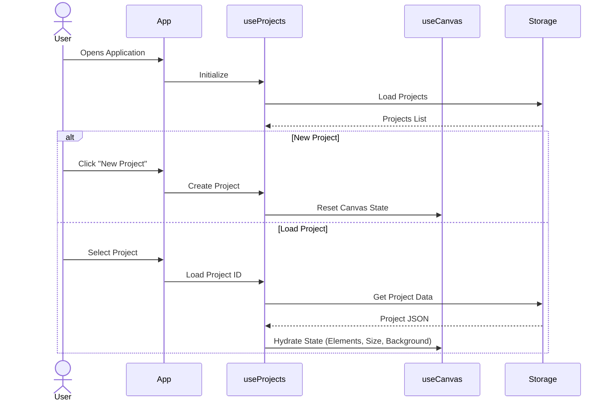
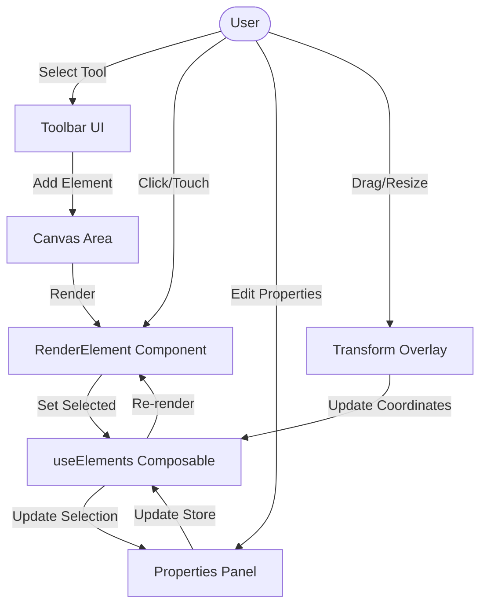
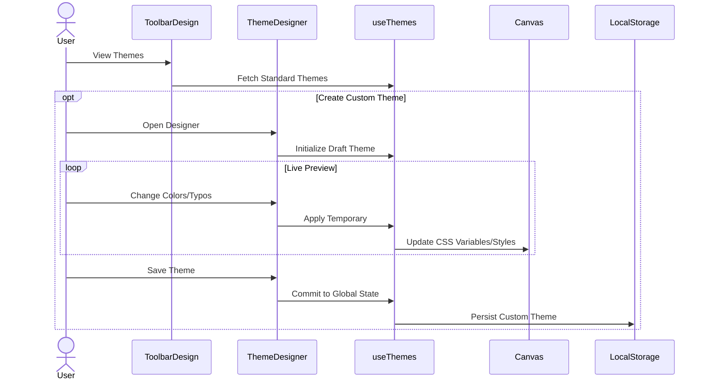
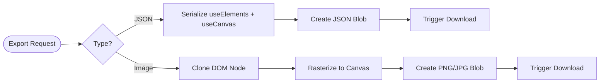

# PosterLabs

An advanced, browser-based poster and banner design studio built with Vue 3 and TypeScript. Create professional designs with a powerful, intuitive drag-and-drop interface.

## 🚀 Features

### Core Design Tools
- **Drag & Drop Interface**: Easily add texts, images, and shapes.
- **Advanced Typography**: Google Fonts integration, text styles, and effects.
- **Image Editing**: Crop, filter, and adjust images directly on the canvas.
- **Smart Alignment Guides**: Intelligent snapping and measurement measuring (gaps) to create pixel-perfect layouts.
- **Marquee Selection**: Drag-to-select multiple elements for group editing.

### Project Management
- **Local Storage / JSON Import & Export**: Save your projects locally or export them as `.json` or `.posterLabs` files to share or backup.
- **Import as New**: Seamlessly import existing project files to start fresh versions.
- **Undo/Redo History**: Fearless editing with robust state management.

### Tech Stack
- **Framework**: Vue 3 (Composition API)
- **Language**: TypeScript
- **Styling**: Tailwind CSS + Material Web Components
- **Icons**: Lucide Vue Next
- **Build Tool**: Vite

## 🔄 System Architecture & Flows

### 1. Project Initialization


### 2. Element Interaction Cycle


### 3. Theme Management


### 4. Export Workflow


## 📘 Developer Manual
For developers looking to programmatically generate templates or understand the project file structure, check out the [JSON Schema Guide](./project_schema_guide.md).

## 🛠️ Project Setup

```bash
# Install dependencies
npm install

# Start development server
npm run dev

# Build for production
npm run build
```

## 📂 Project Structure
- `src/components/Editor/`: Canvas, Renderer, and interactive elements.
- `src/components/UI/sections/`: Modular toolbar components (Projects, Design, Elements, etc.).
- `src/composables/`: Shared logic (State Management) via Composables (`useCanvas`, `useElements`, `useProjects`, etc.).


Learn more about the recommended Project Setup and IDE Support in the [Vue Docs TypeScript Guide](https://vuejs.org/guide/typescript/overview.html#project-setup).
